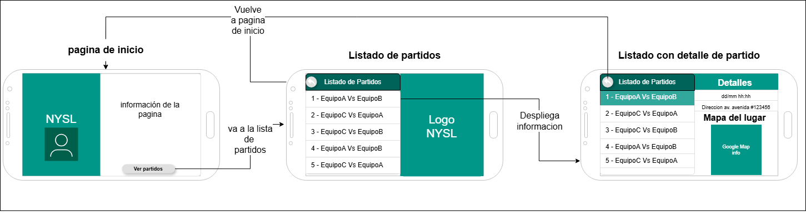
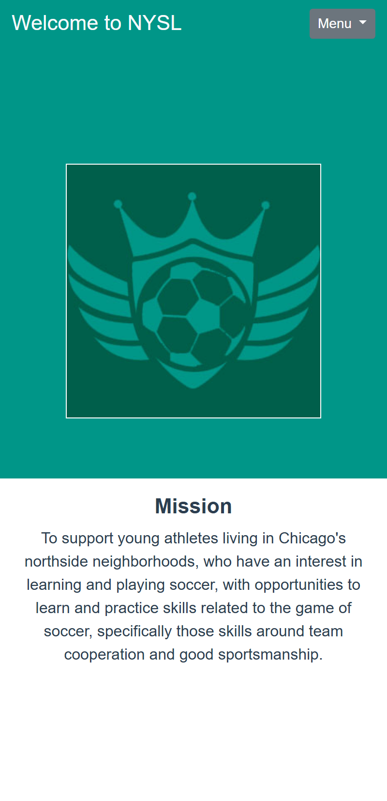
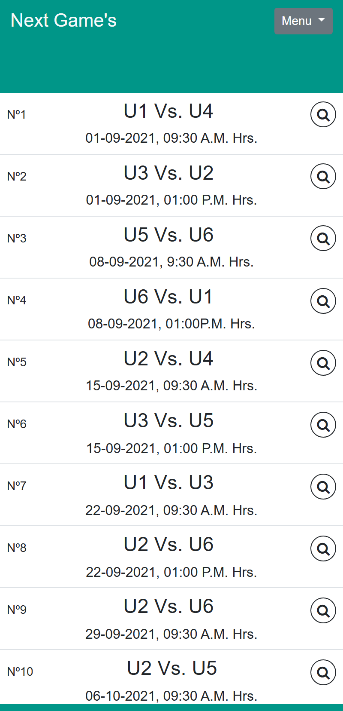
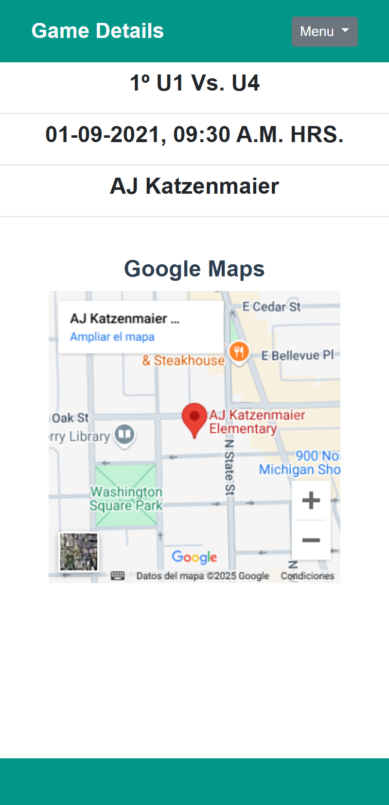
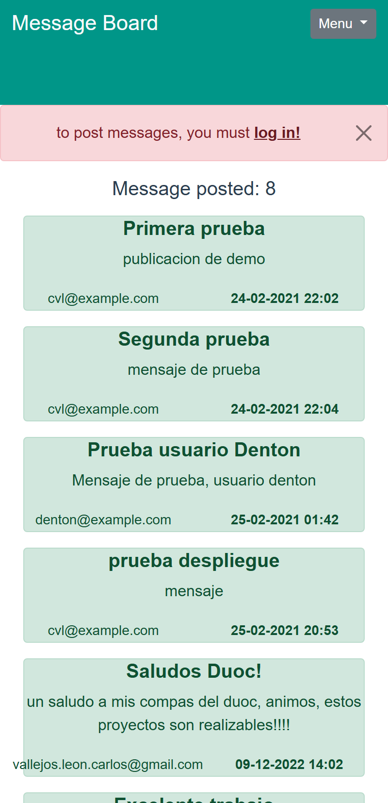
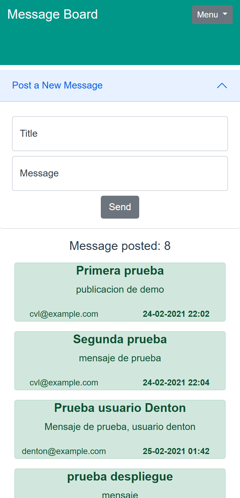
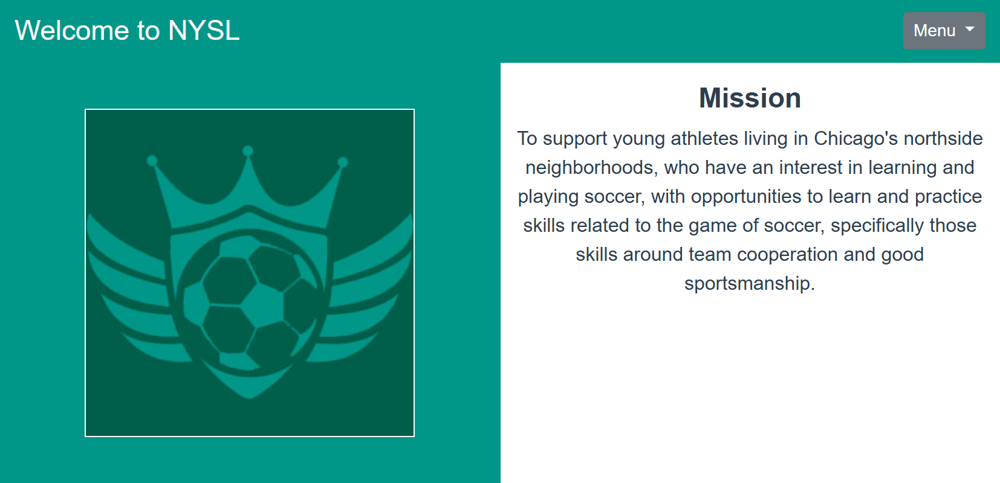
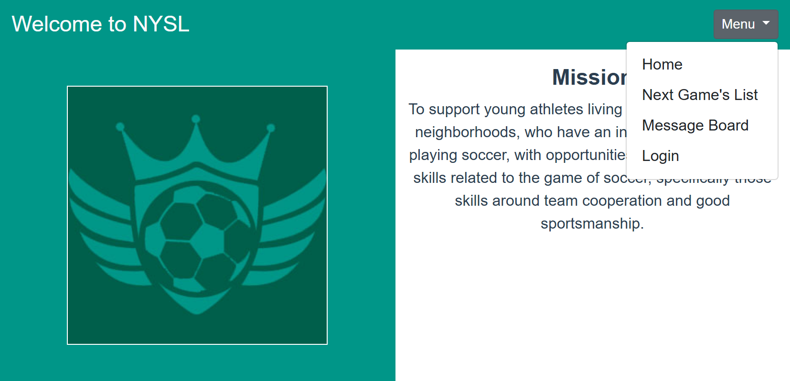
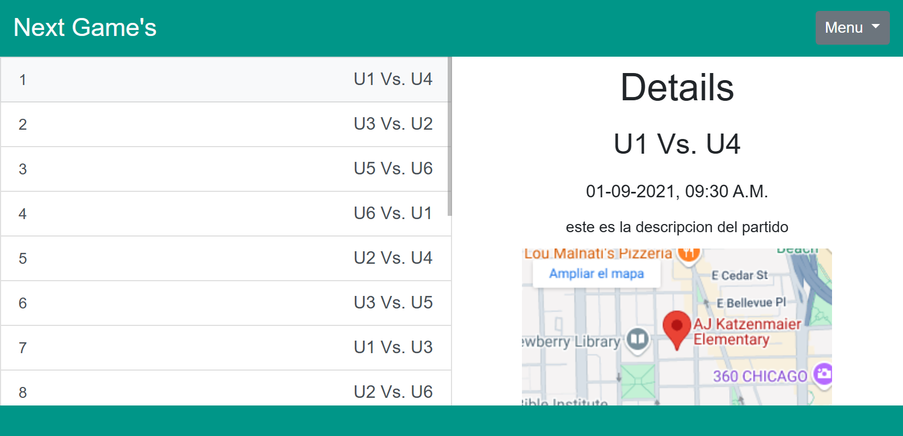
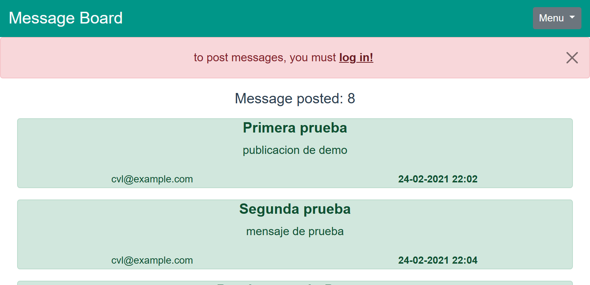

# Proyecto NYSL (cuarta evaluacion)

## 📄 Descripción General

El **Proyecto NYSL** es una aplicación web desarrollada como parte del curso de **Programación Front-End - Talento Digital (2023)** siendo la continuacion de una serie de mejoras. Esta aplicación está diseñada para proporcionar información sobre los partidos y detalles de la liga de fútbol juvenil de Chicago. Su objetivo principal es apoyar a los jóvenes atletas de los vecindarios del lado norte de Chicago, brindándoles oportunidades para aprender y practicar habilidades relacionadas con el fútbol, como la cooperación en equipo y el buen espíritu deportivo.

Esta versión incluye mejoras solicitadas por usuarios, específicamente padres de jugadores, para hacer que la experiencia sea más intuitiva y eficiente.

---

## 📕 Cambios y Mejoras Implementadas

En esta iteración del proyecto, se realizaron las siguientes actualizaciones en base a las solicitudes de los usuarios:

1. **Mapa para la Dirección de los Juegos**:  
   Ahora, al seleccionar un partido para ver los detalles, se incluye un mapa interactivo que muestra la ubicación exacta del juego junto con la dirección detallada.

2. **Vista Dividida en Modo Horizontal**:  
   Al girar el teléfono al modo horizontal, la aplicación muestra una vista dividida con:
   - Una lista de juegos en la parte izquierda.
   - Detalles del juego seleccionado en la parte derecha.  
   Esto permite a los usuarios alternar entre juegos rápidamente sin recargar toda la página.

3. **Mejor Rendimiento de la Navegación**:  
   La funcionalidad de actualización entre las páginas de detalles del juego ahora es más rápida y fluida, lo que reduce significativamente el tiempo de espera.

4. **Tablón de Comentarios con Inicio de Sesión en Firebase**:  
   Se ha implementado un tablón de comentarios donde los usuarios pueden dejar sus opiniones y comentarios sobre los partidos. Esta funcionalidad requiere que los usuarios inicien sesión a través de Firebase, lo que garantiza que solo los usuarios autenticados puedan publicar comentarios.

5. **Usuario de Pruebas**:  
   Se ha habilitado un usuario de pruebas para que los interesados puedan explorar la aplicación sin necesidad de crear una cuenta. Este usuario de pruebas puede ser solicitado enviando un correo electrónico al dueño del repositorio.

## NOTA
**considerar que esta orientado solo para su uso en moviles, en esta fase solo de manera vertical**
---

## 📈 Diagrama de Flujo de Navegación

El siguiente diagrama ilustra la navegación dentro de la aplicación web, destacando las rutas principales para la lista de partidos y la página de detalles:

 

---

## 📷 Capturas de Pantalla

A continuación, se presentan algunas capturas de pantalla de la aplicación:

** 🛠️ Version 1**

Página de Inicio Muestra el contenido principal y la navegación inicial para los usuarios: 

   

Lista de Partidos Tabla con todos los partidos disponibles, incluyendo detalles como equipos, fechas y ubicaciones:

   

Vista de detalles Página de detalles de partido: 

   

** 🛠️ Version 2 vertical**

  
  
  
  
  

** 🛠️ Version 2 horizontal**

 

 

 

 

 

---

## 📦 Tecnologías Utilizadas

El proyecto sigue utilizando las siguientes tecnologías modernas para su desarrollo y funcionamiento:

- **Vue.js**: Framework progresivo de JavaScript para construir interfaces de usuario y aplicaciones de una sola página (SPA).
- **Vue Router**: Biblioteca oficial de Vue.js para el enrutamiento, que permite la navegación fluida entre diferentes vistas.
- **Sass**: Preprocesador de CSS que facilita la escritura de estilos organizados y eficientes.
- **Bootstrap**: Framework de CSS para diseño de interfaces web responsivas y modernas.
- **Font Awesome**: Biblioteca de iconos escalables y personalizables mediante CSS.
- **Firebase Hosting**: Servicio de alojamiento web rápido y seguro proporcionado por Firebase.
- **Node.js** y **npm**: Entorno de ejecución de JavaScript del lado del servidor y su gestor de paquetes para manejar dependencias y scripts del proyecto.

---

## 💻 Instalación y Uso

Para abrir localmente:

1. Clona el repositorio:  
   git clone https://github.com/carlosvleon/proyecto_nysl-cuarta-evaluacion.git

2. Navega al directorio del proyecto:  
   cd nysl-project

3. Instala las dependencias:  
   npm install

4. Ejecuta la aplicación en modo desarrollo:  
   npm run serve  
   Luego abre [http://localhost:8080](http://localhost:8080) en tu navegador para ver la aplicación.

5. Compila y minifica para producción:  
   npm run build

6. Ejecuta el linter y corrige archivos:  
   npm run lint

### 🌐 Visitar en Firebase Hosting

[Haz clic aquí para visitar el sitio en Firebase Hosting](https://proyecto-nysl-2.web.app/?#/)

 Solicitar usuario de prueba por interno

---

## 📧 Contacto

Para consultas o sugerencias relacionadas con este proyecto, puedes contactar a:

- ** Nombre del Autor: Carlos Vallejos
- ** Correo Electrónico: [vallejos.leon.carlos@gmail.com]
